#                           Ahmed Hegazy   Data AnalysT

##  Cairo  |   (002) 01090446023   |   ahmed.a.hegazy21@gmail.com   |   [Linkedin](https://www.linkedin.com/in/hegazy-ahmed/)
### About
I am an aspiring data analyst with a strong background in data analytics and proficiency in SQL server, Excel, Power BI, 
Tableau, and Python. I am seeking a data analyst internship where I can leverage my technical skills and passion for 
Analysis and problem solving to support the company's role as a trusted source of information.
I possess strong decision-making and problem-solving abilities, with a keen eye for detail and a highly organized approach 
to work. I am adept at managing relationships with both internal and external stakeholders and have excellent 
communication skills, enabling me to present complex data in a clear and comprehensible manner.

### Skills: 
- Programming: Python, R, SQL
- Data Visualization: Tableau, Power BI, Matplotlib, Seaborn
- Database Management: MySQL, PostgreSQL 
- Statistical Analysis: Hypothesis Testing, Regression Analysis
- Data Analysis
   ,Google Big Query
   ,Google Analytics G4
   ,icrosoft office (Word, PowerPoint, Outlook)
   
#  Education and Certifications

Nile Higher Institute Bachelor of Management Information 2016–2019
 | Cumulative Grade: Very Good
- [ Google Data Analytics Professional Certificate (Coursera)
](https://www.coursera.org/account/accomplishments/professional-cert/4F6K7SEA4KV2)
- Introduction to Data Analytics (Coursera)
- Data Analytics Bootcamp Certificate (YouTube)
- Relevant coursework: Statistics, information Management
- English course (Get Way level 9)
- Introduction to SQL (SKILLUP)

 

# Tableau

)   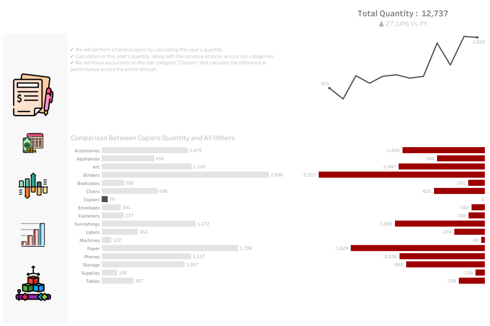

### [BMW Car Sales Dashboar](https://public.tableau.com/app/profile/ahmed.hegazy/viz/Book1_17247314164760/BigPicture) | [ViZ](https://public.tableau.com/app/profile/ahmed.hegazy/viz/Book1_17247314164760/BigPicture) | [Exploration](https://view.officeapps.live.com/op/view.aspx?src=https%3A%2F%2Fraw.githubusercontent.com%2FAhmedHegazy121%2FportfolioProjects%2Fmain%2FExploration.pptx&wdOrigin=BROWSELINK)

I have worked on three dynamic and interactive dashboards for BMW. The first one provides an overview of the annual revenue, highlighting the year with the highest revenue. 
The second dashboard offers an interactive comparison of the current year’s revenue with the previous year, allowing users to explore the differences. 
The third dashboard dives deep into each BMW model, offering detailed and interactive insights into every single model. All these dashboards are designed to be highly dynamic and user-friendly.

**What are the Key Insights that we could focus on to provide Valuable Information**
- Revenue Trends
- Top-Selling Models
- Sales Performance by Country
- Sales Channel Performance
- Quantity Sold
- Year over Year Analysis

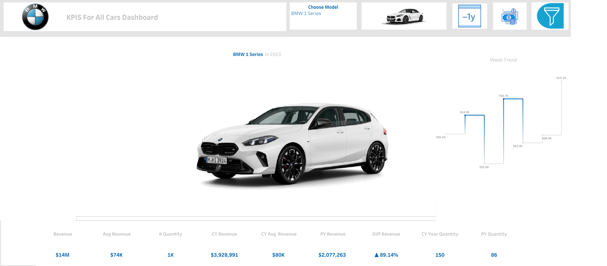
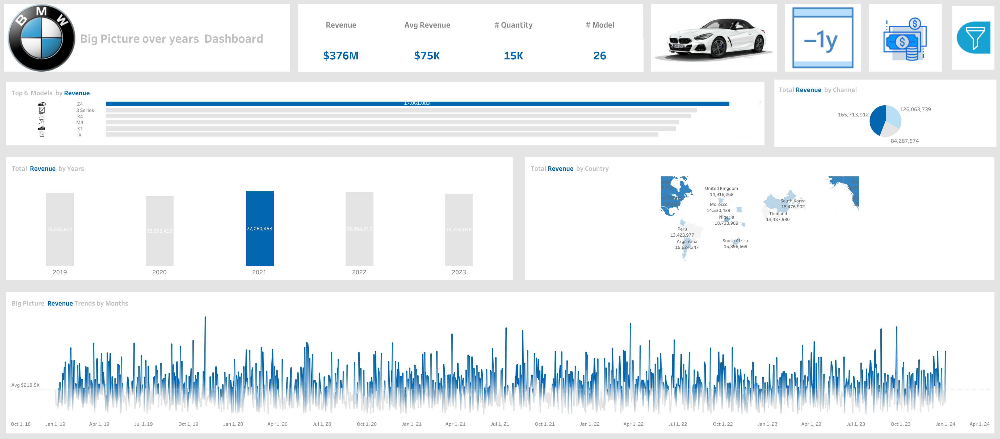
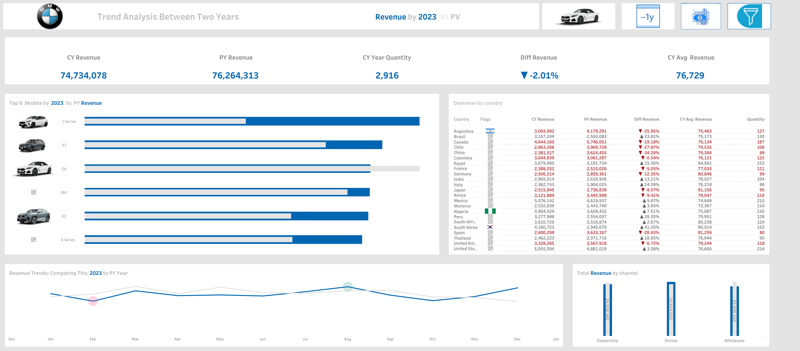

### **[Case Study: How Does a Bike-Share Navigate Speedy Success Dashboard](https://public.tableau.com/views/CaseStudyHowDoesaBike-ShareNavigateSpeedySuccess_17228246429470/Dashboard1?:language=en-US&:sid=&:redirect=auth&:display_count=n&:origin=viz_share_link)**  | [Link](https://public.tableau.com/views/CaseStudyHowDoesaBike-ShareNavigateSpeedySuccess_17228246429470/Dashboard1?:showVizHome=no)

How do annual members and casual riders use Cyclistic bikes differently?

***To answer these questions, we will delve into the following topics:**

- Duration and frequency of rides: We will analyze data to understand the typical length of rides for both user groups. Are there noticeable differences between casual riders and members? Are members using the bikes more frequently or for longer duration?

- Ride timings: We’ll investigate if there’s a difference in the time of day, day of the week, or month of the year when the two user groups typically use the bikes.

- Bike preferences: Given that Cyclistic offers various bike options, we will examine if there’s a pattern in the type of bike preferred by the two user groups.

Answering these questions will provide insights into the riding patterns of the two groups (annual member and casual renters), and will be instrumental in forming the foundation for a marketing strategy aimed at converting casual riders into annual members. The strategy will be developed in alignment with these insights, addressing the unique needs and behaviors of casual riders to motivate their transition to becoming annual members.

Cyclistic’s collected data forms the backbone of this analysis. For transparency, we have included the source code in the paper’s Appendix. We strive to communicate our findings clearly, pairing concise language with comprehensible visualizations and straightforward recommendations.

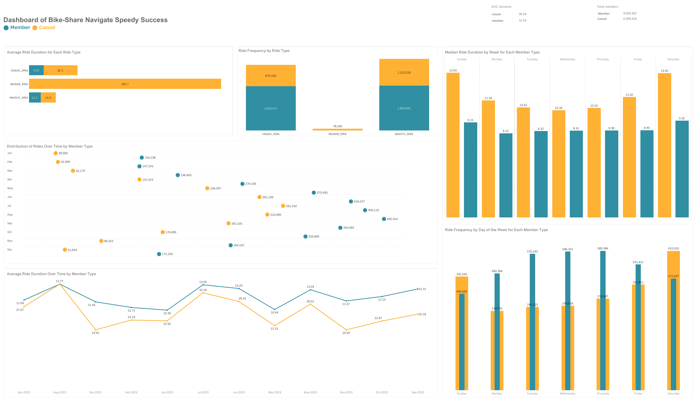

### [Sales Performance Dashboard](https://www.linkedin.com/posts/hegazy-ahmed_sales-dashboard-activity-7222760336511107072-B8-r?utm_source=share&utm_medium=member_desktop) | [Video](https://www.linkedin.com/posts/hegazy-ahmed_dataanalysis-tableau-salesdashboard-activity-7220992076723720193-jkez?utm_source=share&utm_medium=member_desktop) | [persentation](https://www.linkedin.com/posts/hegazy-ahmed_sales-dashboard-activity-7222760336511107072-B8-r?utm_source=share&utm_medium=member_desktop) 

The purpose of sales dashboard is to present an overview of the sales metrics and trends in order to analyze year-over-year sales performance and understand sales trends.
The customer dashboard aims to provide an overview of customer data, trends and behaviors. It will help marketing teams and management to understand customer segments and improve customer satisfaction.
Key Requirements
KPI Overview
Display a summary of total sales, profits and quantity for the current year and the previous year.
Sales Trends

 – Present the data for each KPI on a monthly basis for both the current year and the previous year.
 – Identify months with highest and lowest sales and make them easy to recognize.
Product Subcategory Comparison

 – Compare sales performance by different product subcategories for the current year and the previous year.
 – Include a comparison of sales with profit.
Weekly Trends for Sales & Profit

 – Present weekly sales and profit data for the current year.
 – Display the average weekly values.
 – Highlight weeks that are above and below the average to draw attention to sales & profit performance.
 Customer Trends
 
 – Present the data for each KPI on a monthly basis for both the current year and the previous year.
 – Identify months with highest and lowest sales and make them easy to recognize.
Customer Distribution by Number of Orders
Represent the distribution of customers based on the number of orders they have placed to provide insights into customer behavior, loyalty and engagement.
Top 10 Customers By Profit

 – Present the top 10 customers who have generated the highest profits for the company.
 – Show additional information like rank, number of orders, current sales, current profit and the last order date.

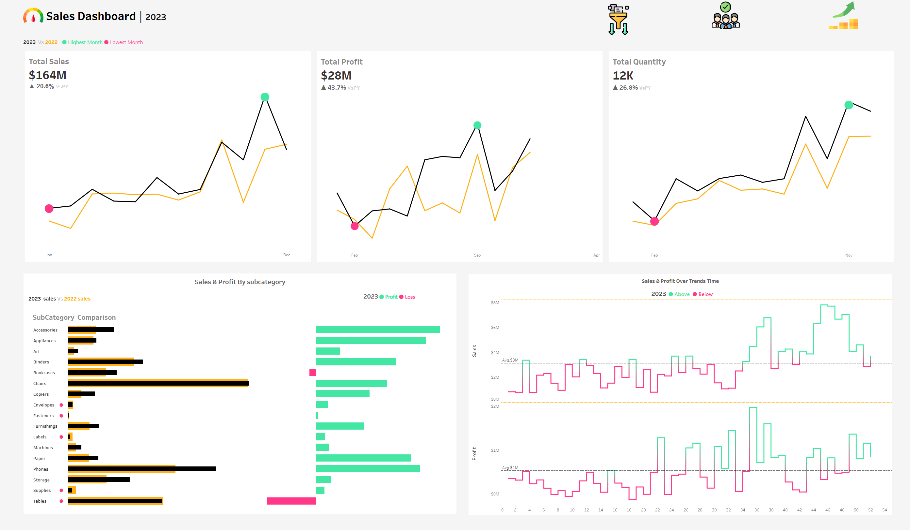

###  [Break Down between Female and Male Dashboard ](https://public.tableau.com/app/profile/ahmed.hegazy/viz/BreakdownbetweenMandF/Dashboard1) | **[Link to VIZ ](https://public.tableau.com/app/profile/ahmed.hegazy/viz/BreakdownbetweenMandF/Dashboard1)**
**Key Responsibilities:**

-Employee Gender Breakdown (1990-Present):

-Analyzed employee distribution by gender over the years using SQL.
Departmental Gender Comparison:

-Compared male and female employee distribution across departments over time.
Average Salary Analysis by Gender:

-Calculated and compared average salaries of male and female employees by department.
Salary Range Analysis (50,000 - 90,000):

-Developed a stored procedure to analyze average salaries within a specified range by gender and department.
Technologies Used: SQL, Stored Procedures

Outcome: Provided valuable insights into gender distribution, departmental trends, and salary equity, aiding HR in informed decision-making.

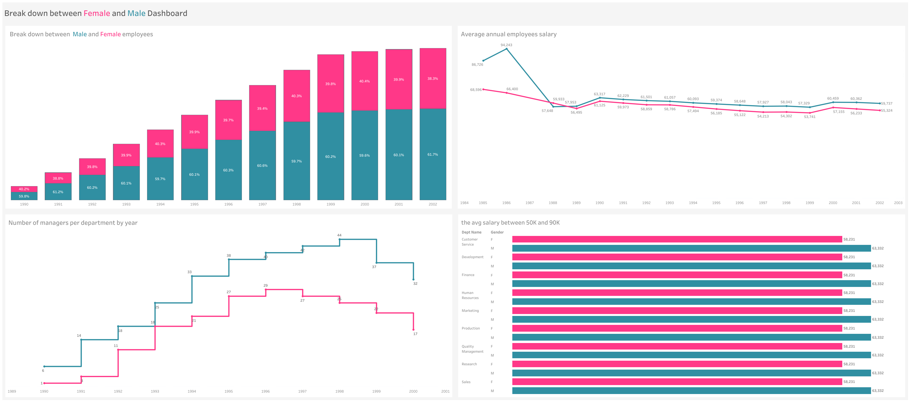

# Python

### [Case Study: How Does a Bike-Share Navigate Speedy Success](https://github.com/AhmedHegazy121/portfolioProjects/blob/main/Share%20_Bike.ipynb)  |  [Link](https://github.com/AhmedHegazy121/portfolioProjects/blob/main/Share%20_Bike.ipynb)

 **brief summary of your cleaned dataframe bike:**
- Loaded Data: You've successfully loaded 12 CSV files for each month of 2023.
- Merged Data: Merged these files into a single dataframe.
- Converted Datatypes: Converted started_at and ended_at columns to datetime format.
- Renamed Columns: Renamed columns for clarity.
- Created New Columns: Added columns for time, month, year, day of the week, and a combined month-year column.
- Calculated Ride Length: Calculated the length of each ride in minutes.
- Removed Negative Durations: Dropped rows with negative ride lengths.
- Conduct descriptive analysis.
- Export a summary file for further analysis.

### [Cleaning Data use Python](https://github.com/AhmedHegazy121/portfolioProjects/blob/main/Clean_Cricketers.ipynb) |  [Link](https://github.com/AhmedHegazy121/portfolioProjects/blob/main/Clean_Cricketers.ipynb)

**Here's an explanation of the steps taken in your code:**

Reading the CSV File: The code reads a CSV file named New.csv into a pandas DataFrame named df, which contains data about cricket players and their performance statistics.

Renaming Columns: Several columns are renamed to more descriptive names, such as "Mat" to "matches_played", "Inns" to "innings_batted", "NO" to "not_outs", etc., for better readability and understanding of the data.

Checking for Null Values: The code checks for any null values in the DataFrame and finds that several columns contain null values.

Handling Missing Values: Specifically, the code identifies that the "balls_faced" and "batting_strike_rate" columns contain null values for some players. It fills these null values with 0 to handle missing data appropriately.

Dropping Duplicate Rows: The code identifies and drops duplicate rows in the DataFrame to ensure that each player is represented only once in the dataset.

Splitting the Span Column: The "Span" column, which contains the years a player was active, is split into two separate columns, "Rooki_year" and "final_year", representing the start and end years of the player's career.

Dropping Unnecessary Columns: The original "Span" column is dropped from the DataFrame as it has been replaced by the new "Rooki_year" and "final_year" columns.

Dropping a Specific Row: Finally, the code drops a row with index 67, which contains NaN values in all columns, to clean up the DataFrame further and ensure no irrelevant data remains.

### [The CoinMarketCap API](https://github.com/AhmedHegazy121/portfolioProjects/blob/main/API.ipynb) | [Link](https://github.com/AhmedHegazy121/portfolioProjects/blob/main/API.ipynb)

Here is a refined and complete version of the code to fetch the latest cryptocurrency listings from the CoinMarketCap API. Make sure to handle the API key securely.
The script fetches the latest cryptocurrency listings from the CoinMarketCap API. It sets up a session with the necessary headers, including the API key, and sends a GET request to the API endpoint with specified parameters.
The response is parsed as JSON and printed in a readable format. Errors such as connection issues, timeouts, and too many redirects are handled gracefully.

# SQL 

### [SQL Value Window Functions | LEAD, LAG, FIRST_VALUE, LAST_VALUE](https://github.com/AhmedHegazy121/portfolioProjects/blob/main/SQL%20Value%20Window%20Functions.sql)

**Tasks :**
- Analyze the month-over-month (MoM) performonce by finding the percentage change in sales between the current and previous month.
- Anaylze customer loyalty by ranking customers based on the average number of days between  orders
- Find the  lowest and highest sales for each product
- use case compare to Extermes How well a value is performing relative to the extremes

### [Advanced SQL Aggregate Window Functions ](https://github.com/AhmedHegazy121/portfolioProjects/blob/main/Advanced_aggregations.sql) | [Link](https://github.com/AhmedHegazy121/portfolioProjects/blob/main/Advanced_aggregations.sql) | [Video](https://www.linkedin.com/posts/hegazy-ahmed_sql-mysqlserver-analysis-activity-7236908944193929216-pUp-?utm_source=share&utm_medium=member_desktop)

These queries aim to perform various analyses such as calculating totals, averages, rankings, and detecting duplicates or deviations, making them valuable tools for data analysis and reporting.

**Insight**

- Find the total sales across all orders and by each product. Additionally, provide details such as order ID, order date, and sales.
- Rank each order based on their sales from highest to lowest, and provide details such as order ID and order date.
- Calculate the total sales using a sliding window of two following rows after the current row, and provide details such as order ID, order date, and sales.
- Calculate the total sales using a sliding window of two preceding rows before the current row, and provide details such as order ID, order date, and sales.
- Rank customers based on their total sales.
- Find the total number of orders and the total number of orders for each customer. Additionally, provide details such as order ID and order date.
- Check for null values by finding the total number of customers and the total number of scores for the customers. Additionally, provide all details of customers.
- Check whether the table Orders contains any duplicate rows by counting the primary key.
- Find the total sales across all orders and the total sales for each product. Additionally, provide details such as order ID and order date.
- Find the percentage contribution of each product's sales to the total sales.
- Find the average sales across all orders and the average sales for each product. Additionally, provide details such as order ID and order date.
- Find the average scores of customers. Additionally, provide details such as customer ID and last name.
- Find all orders where sales are higher than the average sales across all orders.
- Find the highest and lowest sales across all orders and for each product. Additionally, provide details such as order ID and order date.
- Calculate the deviation of each sale from both the minimum and maximum sales amounts.
- Show the employees who have the highest salaries.
- Calculate the moving average of sales for each product over time, including only the next order.

### [Advanced Ranking Window Use Cases](https://github.com/AhmedHegazy121/portfolioProjects/blob/main/Ranking_Windows.sql)  | [link](https://github.com/AhmedHegazy121/portfolioProjects/blob/main/Ranking_Windows.sql) 

**Insights**

- Orders are ranked based on their sales from highest to lowest.

- A unique rank is assigned to each order.

- Ties are allowed, so orders with identical sales receive the same rank.

- Ranks are assigned with no gaps in the case of ties.

- Analyze top performers to guide targeted marketing efforts.

- Identify the highest sales for each product to focus on the best-selling products.

- Identify underperformers to help manage risks and optimize strategies.

- Find the two customers with the lowest total sales to identify potential churn risks.

- Assign new IDs to the rows in the orders archive table.

- This helps uniquely identify rows in the archive.

- Identify and remove duplicate rows in the Orders Archive.

- Retain only the first occurrence of each unique row.

### [Case When Statement ](https://github.com/AhmedHegazy121/portfolioProjects/blob/main/Case.sql)
**Task**
- Generate a report showing the total sales for each category.
- Retrieve employee details with gender displayed as full text.
- Find average scores of customers and treat Nulls as 0 and additional provide details such customrID and Lastname.
- count how many times each customers has made an order with sales greater than 30.

### [Union Use Cases](https://github.com/AhmedHegazy121/portfolioProjects/blob/main/Union.sql)

**Tasks:**
- Combine the data from employees and customers into one table.
- Combine the data from employees and customers into one table including duplicates,
- Find employees who are not customers at the same time.
- Find empoyees who are also customers.
- combine all orders into one report without duplicates.

### [Exploratory Data Analysis Using SQL and Tableau](https://github.com/AhmedHegazy121/portfolioProjects/blob/main/breaking%20_down%20_%20bteween_%20Female_%20and_%20Male.sql) | [Link ](https://github.com/AhmedHegazy121/portfolioProjects/blob/main/breaking%20_down%20_%20bteween_%20Female_%20and_%20Male.sql) | [Link to VIZ ](https://public.tableau.com/app/profile/ahmed.hegazy/viz/BreakdownbetweenMandF/Dashboard1)
  
  
   **KPIs**
   Objective: Analyze employee demographics and salary data to provide insights into gender distribution, departmental employment trends, and salary comparisons.

Key Responsibilities:

- Employee Gender Breakdown (1990-Present):

- Analyzed employee distribution by gender over the years using SQL.
  Departmental Gender Comparison:

- Compared male and female employee distribution across departments over time.
  Average Salary Analysis by Gender:

- Calculated and compared average salaries of male and female employees by department.
 Salary Range Analysis (50,000 - 90,000):

- Developed a stored procedure to analyze average salaries within a specified range by gender and department.
  Technologies Used: SQL, Stored Procedures

Outcome: Provided valuable insights into gender distribution, departmental trends, and salary equity, aiding HR in informed decision-making.

### [This SQL script focuses on generating key insights and KPIs for a food delivery system ](https://github.com/AhmedHegazy121/portfolioProjects/blob/main/Food.sql) | [Link to Project](https://github.com/AhmedHegazy121/portfolioProjects/blob/main/Food.sql)
 
- Create Datasets 
- This SQL script focuses on generating key insights and KPIs for a food delivery system:
- Total Rolls Ordered: A total count of all rolls ordered is calculated, providing insight into overall demand.
- Unique Customers: The number of unique customers is identified, highlighting the customer base size.
- Driver Performance: The script calculates the number of successful orders delivered by each driver, excluding cancellations. This serves as a KPI for driver efficiency.
- Roll Type Popularity: It tracks the number of each type of roll (vegetarian vs. non-vegetarian) delivered, offering insights into customer preferences.
- Order Volume per Customer: The analysis includes how many rolls each customer ordered, segmented by roll type, which is key for understanding customer behavior.
- Max Rolls in a Single Order: The script identifies the maximum number of rolls delivered in a single order, a KPI that may indicate peak order sizes.
- Data Quality and Cleaning: The script accounts for null, NaN, and whitespace in the dataset, ensuring clean data before analysis.
- Database and Table Creation: It sets up the necessary tables (driver, ingredients, rolls, etc.) and populates them with sample data to support the analysis.
- Order Success Rate: By filtering out canceled orders, the script provides a clear view of successful deliveries, which is critical for assessing overall service reliability.
- Customer Preferences and Customization: Analyzes data on items not included or extra items requested in orders, offering insights into customer preferences for roll customization.

# PowerBI

### [Fleet Management Dashboard](https://www.linkedin.com/posts/hegazy-ahmed_hello-everyone-i-have-created-fleet-management-activity-7138771849252958210-OGlD?utm_source=share&utm_medium=member_desktop) | [Link](https://www.linkedin.com/posts/hegazy-ahmed_hello-everyone-i-have-created-fleet-management-activity-7138771849252958210-OGlD?utm_source=share&utm_medium=member_desktop)

To improve customer retention, focus on several key strategies. Implement loyalty programs and personalized communication to encourage repeat purchases. 

Leverage purchase patterns for upselling and cross-selling opportunities, increasing average order value. Engage with customers regularly through email campaigns, newsletters, or social media to keep them informed about new products and promotions. 

Encourage customers to leave feedback and reviews, which can attract new customers and boost loyalty. Segment customers based on their purchase history for targeted marketing campaigns with personalized promotions. 

Analyze the customer journey to identify and improve any pain points. Provide excellent customer support to promptly address any issues or concerns.

Implement referral programs, offering incentives for successful referrals to expand the customer base. Conduct competitor analysis to understand why customers choose your business over others and enhance your offerings accordingly. 

By focusing on these strategies, the business can build a loyal customer base and achieve long-term growth and success.

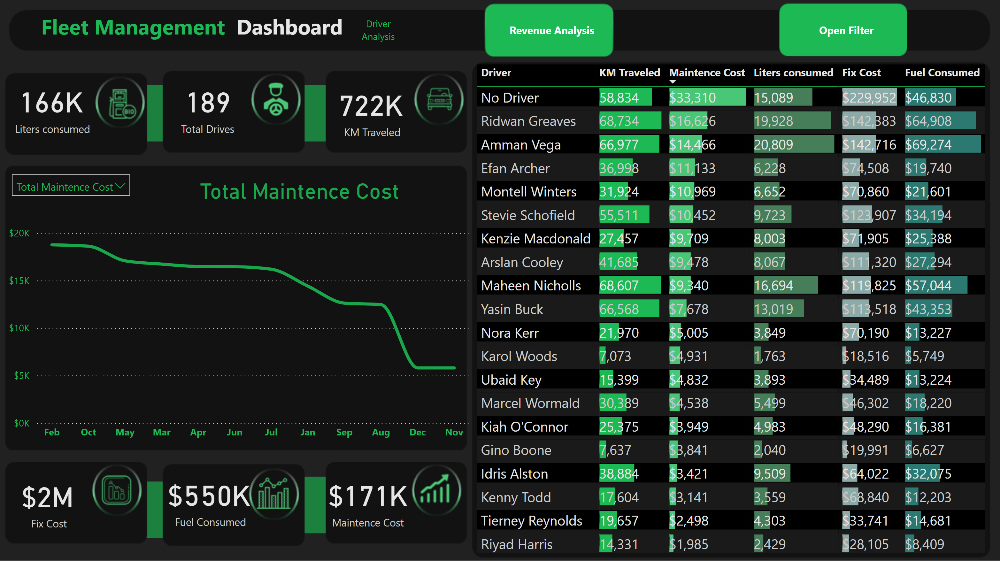

### [Analyzing email marketing performance](https://www.linkedin.com/posts/hegazy-ahmed_marketing-mail-mailcamapign-activity-7184779199214219265-rVsn?utm_source=share&utm_medium=member_desktop) | [Link](https://www.linkedin.com/posts/hegazy-ahmed_marketing-mail-mailcamapign-activity-7184779199214219265-rVsn?utm_source=share&utm_medium=member_desktop)

**KPIs**

- Open Rate: This metric measures the percentage of recipients who opened your email.
- Click-Through Rate (CTR): CTR measures the percentage of recipients who clicked on a link or call-to-action within your email.
- Bounce Rate: Bounce rate indicates the percentage of emails that were not successfully delivered to recipients' inboxes.
- Time and Day of Sending: Analyzing the performance of your emails based on the time and day they were sent can help identify the optimal send times for your audience.

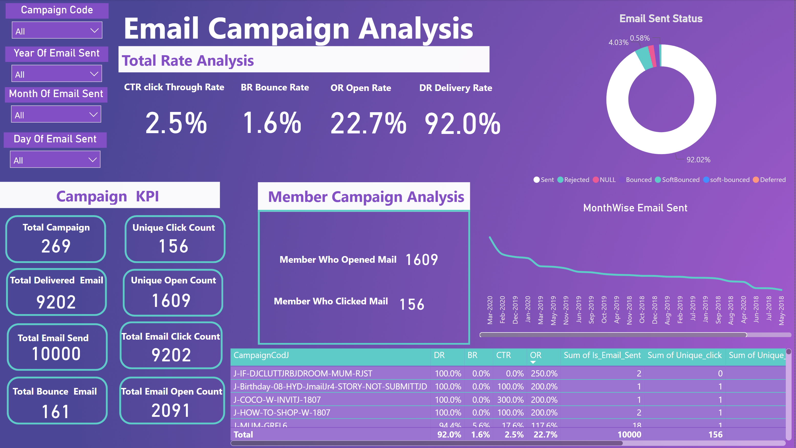

# Excel

### [Analyzing Business Insights for Bike Storee](https://www.linkedin.com/feed/update/urn:li:activity:7218037173088886784/) | [Link](https://www.linkedin.com/feed/update/urn:li:activity:7218037173088886784/)

In reviewing our recent financial performance, several key insights have emerged that shape our strategic recommendations for the future:

- Understanding Revenue Trends:
We observed a decline in total revenue from $3,845,515 in 2017 to $2,023,989 in 2018, signaling a need for focused strategic adjustments.

- Spotlight on Monthly and Geographic Revenue Distribution:
April 2018 stood out with $900,000 in revenue, comprising 44.5% of our annual total—a crucial outlier month. Geographically, New York led with $5,826,242, followed by California at $1,790,146 and Texas at $962,601.

- Brand and Product Performance:
Marcelene Boyer emerged as our top-performing brand, while Mountain Bikes dominated sales with $3,030,776 in revenue. Cruisers Bicycles, with 1,378 orders totaling $1,109,151, showcased strong customer demand.

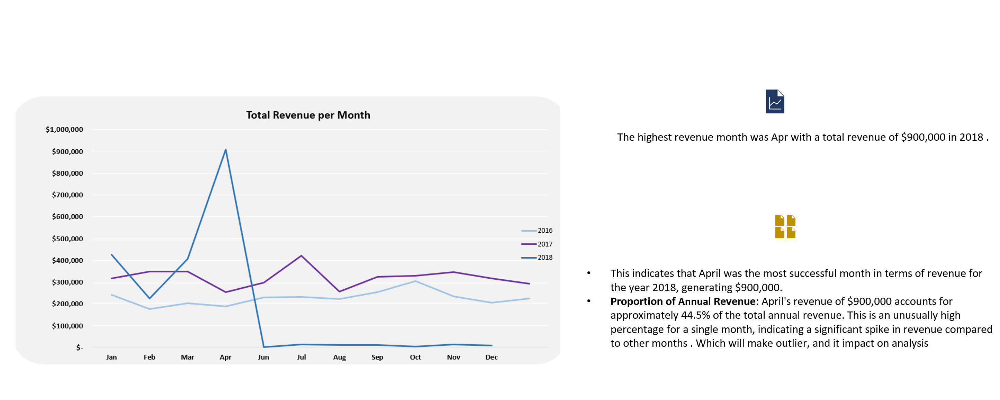

### [Sales performce](https://www.linkedin.com/posts/hegazy-ahmed_excel-dataanalyst-datavisualization-activity-7116746036001275904-J6TA?utm_source=share&utm_medium=member_desktop) | [Link](https://www.linkedin.com/posts/hegazy-ahmed_excel-dataanalyst-datavisualization-activity-7116746036001275904-J6TA?utm_source=share&utm_medium=member_desktop)

the company earned a total of 15,990,000,000 EGP in 2023. Top consultants by sales revenue include Mohmed, Rony, Hany, Dary, and Kisho, with Mohmed leading at 1,727,000,000 EGP. Monthly earnings peaked at 3.8 billion EGP and fluctuated throughout the year, rising notably towards the end.
Of the 926 total paid calls, they accounted for 75% of all calls, with an average duration of 3 minutes and 55 seconds. Advertising expenditure totaled 16 billion EGP, with Television Ads and Facebook being the largest channels. The top sales teams were Mohammed and Salah, each with over 5 billion EGP in sales.
KJL.L4 generated the highest fees among training levels at 3.3 billion EGP. BE and GK training models had the highest consultant fees. There was an average of 195 calls per month and 2,643 courses enrolled.
Advertisement performance varied, showing peaks in certain months, and area code performance was diverse across different regions.

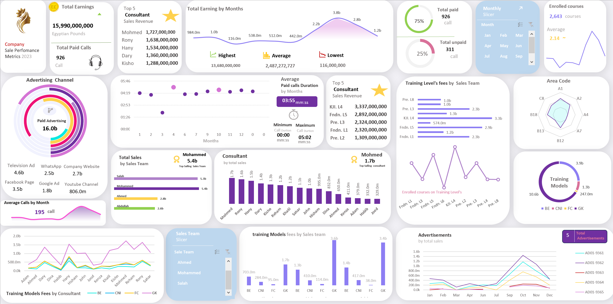

### [HR Attrition dashboard using Excel](https://www.linkedin.com/posts/hegazy-ahmed_hello-everyone-i-have-created-this-hr-attrition-activity-7121396252549758976-5rpk?utm_source=share&utm_medium=member_desktop) | [Link to Project](https://www.linkedin.com/posts/hegazy-ahmed_hello-everyone-i-have-created-this-hr-attrition-activity-7121396252549758976-5rpk?utm_source=share&utm_medium=member_desktop)

- Data Cleaning: In this step includes removing inconsistencies in data, errors, and duplicates and ensuring that the data with which I worked is accurate and reliable for further analysis.
- Data Processing: using Power Query Editor to Create some new columns that involved organizing, sorting, and filtering the data to extract meaningful insights.
Data Analysis: Used various statistical methods to get valuable insights from the data.

**KPIs**
-	What is the total number of employees and the attrition rate within the organization?
-	How many high-performing employees have left compared to low-performing employees?
-	What is the attrition rate based on employees' work distance from the office?
-	Which job roles experience the highest levels of attrition?
-	How does attrition vary by employee education levels?
-	What is the attrition rate among employees who frequently travel for business?
-	 What are the attrition rates by gender?
-	Which departments have the highest attrition rates?
-	Which age group experiences the highest attrition, and what is the average age of employees leaving the organization?
  
  
  
  

